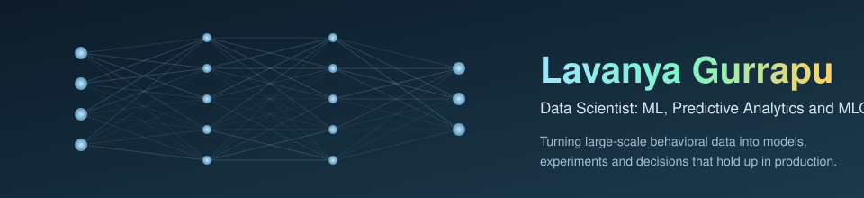

<div align="center">

</div>

<div align="center">


<a href="https://github.com/lavanyag-wq?tab=followers"></a>
<a href="mailto:hellolavanya15@gmail.com"></a>

</div>

## Hi, I'm Lavanya 👋

Data Scientist with 3+ years turning large-scale behavioral data into
models, experiments and decisions. Currently at **Netflix**, working across
recommendation systems, churn prediction, A/B testing and time-series
forecasting; previously built enterprise ML on Azure at **Microsoft**, and
hold an MS in Computer Science (Fairleigh Dickinson University, 2025).

- 🔭 Day to day: predictive modeling, experimentation frameworks, and
  productionizing models with MLflow, Docker and CI/CD
- 🌱 Currently deepening: generative AI and retrieval-augmented systems,
  causal inference, and the craft of trustworthy offline evaluation
- 💬 Happy to talk about: churn modeling, forecasting at scale,
  experiment design, feature pipelines on Spark and Delta Lake
- 📫 Reach me: [hellolavanya15@gmail.com](mailto:hellolavanya15@gmail.com)

> I believe the hard part of data science is rarely the model: it is
> knowing what your data can and cannot tell you, and shipping the
> measurement before you trust the metric.

<div align="center">

## 🛠️ Tech I work with

</div>

**Languages & querying**

<div align="center">

   

</div>

**Machine learning & statistics**

<div align="center">

     

</div>

**Data & pipelines**

<div align="center">

    

</div>

**MLOps & cloud**

<div align="center">

    

</div>

**Analytics & visualization**

<div align="center">

  

</div>

## 📈 My journey

```
2021 ───────────── 2023 ───────────── 2025 ───────────── now
Microsoft, India    MS Computer        Netflix, USA
enterprise ML       Science (US)       recommendations,
on Azure            the deliberate     experimentation,
                    reset              forecasting
```

Three moves, one direction: from building predictive models inside an
enterprise stack, through a formal computer science grounding, to
consumer-scale systems where the interesting problems live in the
measurement: features that skew between training and serving, experiments
read too early, metrics that stay green while something underneath is
quietly wrong.


## 🤝 Let's connect

<div align="center">

<a href="mailto:hellolavanya15@gmail.com "></a>
<a href="http://www.linkedin.com/in/lavanya-reddy-383b403a6"></a>

</div>

<div align="center">

</div>
